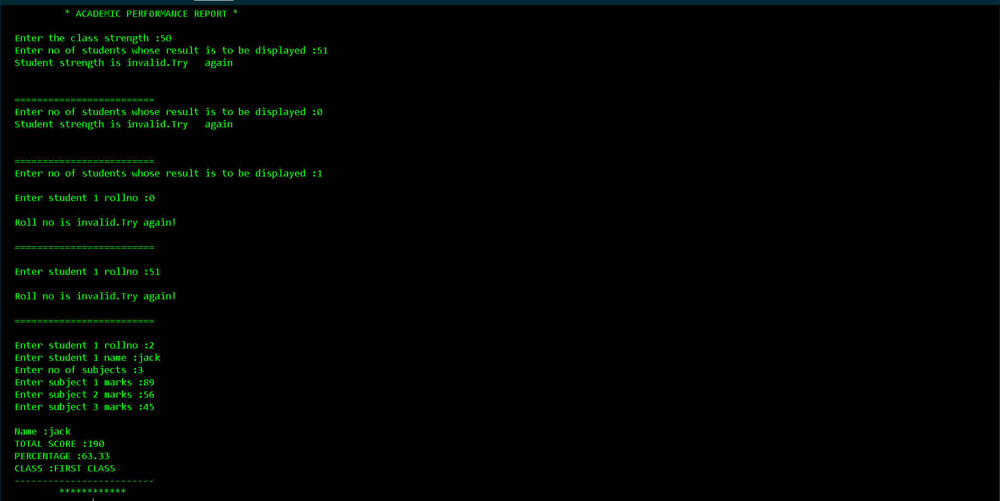

# Academic Performance  Report generator

A simple C program to collect student data like 
* student name
* roll number
* number of subjects
* marks in each subjects(out of 100) 

and display
   **** total score
   **** percentage 
   **** class/division classification
--------------
##  Sample Output:

## Features:
* ### Flexible to handle performance data of multiple students.
* ### Rollno validation test.
* ### Validation for number of students  within the valid range,
* ### Outputs *total score*,*percentage*,and *classification*.
--------------

## How to Run?
Compile the file using any C compiler:

bash(command line)
### *gcc student_proj1.c -o student_proj1./student_proj1* ###
--------------

### Note:For clear screen in the output,append the code with---

//for WINDOWS OS
## *system("cls");*

//for MAC/LINUX OS
## *system("clear");*  
--------------
### Value in this Repo?
If this repository added value to your learning or dev flow, consider dropping a ⭐ *star* or hitting *fork*.
--------------

## Author
***tecnolgd***